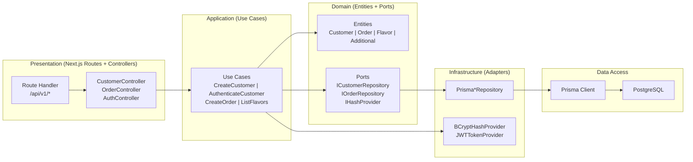
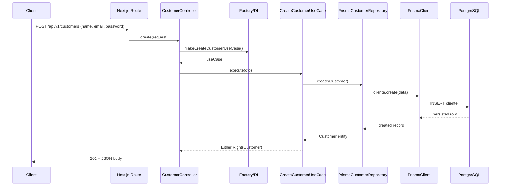
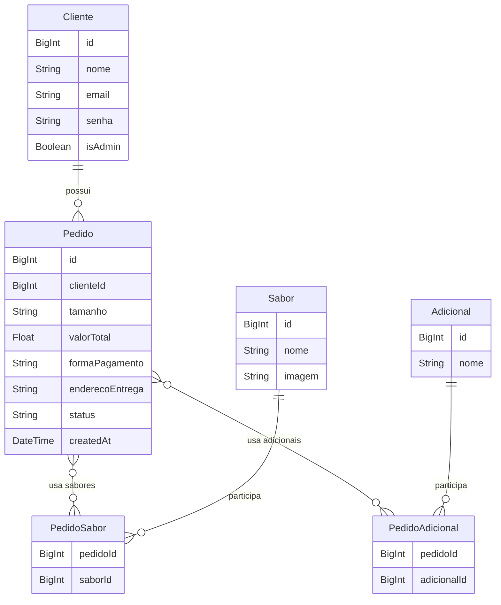

# Arquitetura do Projeto - DDD Hexagonal + Clean Architecture

## 📐 Visão Geral da Arquitetura

Este projeto foi reestruturado seguindo os princípios de **Domain-Driven Design (DDD)**, **Arquitetura Hexagonal (Ports & Adapters)** e **Clean Architecture**, ideais para projetos acadêmicos e profissionais que exigem separação de responsabilidades, testabilidade e manutenibilidade.

## 🏗️ Estrutura de Camadas

```
src/
├── core/                           # NÚCLEO DA APLICAÇÃO (Isolado de frameworks)
│   ├── domain/                     # Domain Layer - Regras de negócio puras
│   │   ├── entities/               # Entidades do domínio
│   │   │   ├── customer.entity.ts
│   │   │   ├── order.entity.ts
│   │   │   ├── flavor.entity.ts
│   │   │   └── additional.entity.ts
│   │   ├── value-objects/          # Value Objects (futura expansão)
│   │   └── repositories/           # Interfaces (Ports de saída)
│   │       ├── customer.repository.interface.ts
│   │       ├── order.repository.interface.ts
│   │       ├── flavor.repository.interface.ts
│   │       ├── additional.repository.interface.ts
│   │       ├── hash-provider.interface.ts
│   │       └── token-provider.interface.ts
│   │
│   └── application/                # Application Layer - Casos de Uso
│       └── use-cases/              # Lógica de aplicação
│           ├── customer/           # Use cases de clientes
│           │   ├── create-customer.use-case.ts
│           │   ├── get-customer-by-id.use-case.ts
│           │   ├── get-customer-by-email.use-case.ts
│           │   ├── list-all-customers.use-case.ts
│           │   ├── update-customer.use-case.ts
│           │   └── delete-customer.use-case.ts
│           ├── order/              # Use cases de pedidos
│           ├── flavor/             # Use cases de sabores
│           ├── additional/         # Use cases de adicionais
│           └── auth/               # Use cases de autenticação
│
├── infrastructure/                 # Infrastructure Layer - Adaptadores
│   ├── database/                   # Implementações de persistência
│   │   └── prisma/
│   │       └── repositories/       # Repositories concretos (Adapters)
│   │           ├── prisma-customer.repository.ts
│   │           ├── prisma-order.repository.ts
│   │           ├── prisma-flavor.repository.ts
│   │           └── prisma-additional.repository.ts
│   ├── cryptography/               # Serviços de criptografia
│   │   ├── bcrypt-hash-provider.ts
│   │   └── jwt-token-provider.ts
│   └── http/                       # Presentation Layer
│       └── controllers/            # Controllers HTTP (Adapters de entrada)
│           ├── customer.controller.ts
│           ├── order.controller.ts
│           ├── flavor.controller.ts
│           ├── additional.controller.ts
│           └── auth.controller.ts
│
├── composition/                    # Composition Root - Injeção de Dependências
│   └── factories/                  # Factories para composição
│       ├── customer-use-case.factory.ts
│       ├── order-use-case.factory.ts
│       ├── flavor-use-case.factory.ts
│       ├── additional-use-case.factory.ts
│       └── auth-use-case.factory.ts
│
└── shared/                         # Shared Kernel - Utilitários compartilhados
    ├── either/                     # Functional error handling
    │   └── either.ts
    └── errors/                     # Hierarquia de erros
        └── app-error.ts
```

## 🎯 Princípios Aplicados

### 1. **SOLID**
- **S**ingle Responsibility: Cada classe tem uma única responsabilidade
- **O**pen/Closed: Aberto para extensão, fechado para modificação
- **L**iskov Substitution: Interfaces substituíveis
- **I**nterface Segregation: Interfaces específicas e coesas
- **D**ependency Inversion: ✨ **Núcleo depende de abstrações, não de implementações**

### 2. **Clean Architecture**
- Regras de negócio isoladas de frameworks
- Dependências apontam para dentro (Domain ← Application ← Infrastructure)
- Testabilidade sem necessidade de banco de dados ou HTTP

### 3. **DDD (Domain-Driven Design)**
- Entidades representam conceitos do domínio
- Linguagem ubíqua (Customer, Order, Flavor, Additional)
- Lógica de negócio concentrada no Domain Layer

### 4. **Hexagonal Architecture (Ports & Adapters)**
- **Ports**: Interfaces (ICustomerRepository, IHashProvider)
- **Adapters**: Implementações (PrismaCustomerRepository, BCryptHashProvider)
- Desacoplamento total entre core e infraestrutura

## 🔄 Fluxo de Dados (Request-Response)

```
┌─────────────────────────────────────────────────────────────┐
│                    HTTP REQUEST                             │
│              (POST /api/v1/customers)                       │
└─────────────────────┬───────────────────────────────────────┘
                      │
                      ▼
┌─────────────────────────────────────────────────────────────┐
│           PRESENTATION LAYER (Adapters)                     │
│    Controller adapta HTTP para Use Case                     │
│         CustomerController.create()                         │
└─────────────────────┬───────────────────────────────────────┘
                      │
                      ▼
┌─────────────────────────────────────────────────────────────┐
│         COMPOSITION LAYER (Dependency Injection)            │
│      Factory cria Use Case com dependências injetadas       │
│         makeCreateCustomerUseCase()                         │
└─────────────────────┬───────────────────────────────────────┘
                      │
                      ▼
┌─────────────────────────────────────────────────────────────┐
│          APPLICATION LAYER (Use Cases)                      │
│     Executa lógica de aplicação (validação, orquestração)  │
│         CreateCustomerUseCase.execute()                     │
└─────────────────────┬───────────────────────────────────────┘
                      │
                      ▼
┌─────────────────────────────────────────────────────────────┐
│              DOMAIN LAYER (Entities)                        │
│       Regras de negócio puras (sem dependências)            │
│            Customer.create()                                │
└─────────────────────┬───────────────────────────────────────┘
                      │
                      ▼
┌─────────────────────────────────────────────────────────────┐
│    INFRASTRUCTURE LAYER (Repository Implementation)        │
│      Persiste no banco através de adapter (Prisma)         │
│      PrismaCustomerRepository.create()                      │
└─────────────────────┬───────────────────────────────────────┘
                      │
                      ▼
┌─────────────────────────────────────────────────────────────┐
│                    DATABASE                                 │
│                  (SQLite/Prisma)                            │
└─────────────────────────────────────────────────────────────┘
```

## 🗺️ Diagramas Mermaid

### Arquitetura em Camadas (Ports & Adapters)



### Sequência: POST /api/v1/customers



### Modelo Relacional (Prisma/PostgreSQL)



## 📍 Rotas API (RESTful)

### Customers (Clientes)
```
GET    /api/v1/customers              # Listar todos
GET    /api/v1/customers?email={email}# Buscar por email
GET    /api/v1/customers/{id}         # Buscar por ID
POST   /api/v1/customers              # Criar novo
PUT    /api/v1/customers              # Atualizar
DELETE /api/v1/customers/{id}         # Deletar
```

### Authentication (Autenticação)
```
POST   /api/v1/auth/login             # Login (retorna JWT)
```

### Orders (Pedidos)
```
GET    /api/v1/orders                 # Listar todos
GET    /api/v1/orders?customerId={id} # Listar por cliente
GET    /api/v1/orders/{id}            # Buscar por ID
POST   /api/v1/orders                 # Criar novo
DELETE /api/v1/orders/{id}            # Deletar
```

### Flavors (Sabores)
```
GET    /api/v1/flavors                # Listar todos
GET    /api/v1/flavors/{id}           # Buscar por ID
```

### Additionals (Adicionais)
```
GET    /api/v1/additionals            # Listar todos
GET    /api/v1/additionals/{id}       # Buscar por ID
```

## 🔐 Tratamento de Erros

Utilizamos **Either** (functional programming) para tratamento de erros tipado:

```typescript
// Either<Error, Success>
type Result = Either<ValidationError, Customer>

// Left = Error
if (result.isLeft()) {
  const error = result.value;
  // Trata erro
}

// Right = Success
if (result.isRight()) {
  const customer = result.value;
  // Usa o resultado
}
```

### Hierarquia de Erros
- `AppError` (base)
  - `NotFoundError`
  - `ValidationError`
  - `DuplicateError`
  - `UnauthorizedError`
  - `InvalidCredentialsError`

## 🧪 Testabilidade

A arquitetura permite testes em múltiplos níveis:

### 1. **Testes Unitários (Use Cases)**
```typescript
// Testa lógica isolada, sem dependências externas
const mockRepository = new InMemoryCustomerRepository();
const mockHashProvider = new FakeHashProvider();
const useCase = new CreateCustomerUseCase(mockRepository, mockHashProvider);
```

### 2. **Testes de Integração (Repositories)**
```typescript
// Testa integração com banco de dados real
const repository = new PrismaCustomerRepository(prisma);
```

### 3. **Testes E2E (Controllers)**
```typescript
// Testa fluxo completo HTTP → Database
await request(app).post('/api/v1/customers').send({ ... });
```

## 🚀 Como Funciona a Injeção de Dependências

### Sem Inversão de Dependência (❌ Acoplado)
```typescript
class CreateCustomerUseCase {
  private repository = new PrismaCustomerRepository(); // Acoplamento!
  
  async execute() {
    await this.repository.create(...); // Impossível testar sem BD
  }
}
```

### Com Inversão de Dependência (✅ Desacoplado)
```typescript
class CreateCustomerUseCase {
  constructor(
    private repository: ICustomerRepository, // Interface (Port)
    private hashProvider: IHashProvider
  ) {}
  
  async execute() {
    await this.repository.create(...); // Funciona com qualquer implementação!
  }
}

// Factory injeta a implementação correta
export const makeCreateCustomerUseCase = () => {
  const repository = new PrismaCustomerRepository(prisma); // Adapter
  const hashProvider = new BCryptHashProvider(); // Adapter
  return new CreateCustomerUseCase(repository, hashProvider);
};
```

## 📚 Benefícios da Arquitetura

### Para Projetos Acadêmicos
✅ Demonstra conhecimento avançado de arquitetura de software  
✅ Fácil de explicar e documentar (camadas bem definidas)  
✅ Testável sem configuração complexa  
✅ Segue padrões da indústria (DDD, Clean Architecture)  

### Para Projetos Profissionais
✅ Altamente escalável e manutenível  
✅ Fácil de adicionar novos casos de uso  
✅ Troca de frameworks/bibliotecas sem afetar o core  
✅ Código limpo seguindo SOLID  

## 🔄 Exemplo Prático: Adicionar Novo Use Case

1. **Criar Use Case** (Application Layer)
```typescript
// src/core/application/use-cases/customer/export-customers.use-case.ts
export class ExportCustomersUseCase {
  constructor(private repository: ICustomerRepository) {}
  
  async execute(): Promise<Either<never, Buffer>> {
    const customers = await this.repository.findAll();
    const csv = this.convertToCSV(customers);
    return right(Buffer.from(csv));
  }
}
```

2. **Criar Factory** (Composition Layer)
```typescript
// src/composition/factories/customer-use-case.factory.ts
export const makeExportCustomersUseCase = () => {
  return new ExportCustomersUseCase(customerRepository);
};
```

3. **Adicionar ao Controller** (Presentation Layer)
```typescript
// src/infrastructure/http/controllers/customer.controller.ts
static async export() {
  const useCase = makeExportCustomersUseCase();
  const result = await useCase.execute();
  return new NextResponse(result.value, { headers: { ... } });
}
```

4. **Criar Rota** (Infrastructure Layer)
```typescript
// src/app/api/v1/customers/export/route.ts
export async function GET() {
  return CustomerController.export();
}
```

## 🎓 Conceitos-Chave

- **Entity**: Objeto com identidade única (Customer, Order)
- **Use Case**: Ação específica da aplicação (CreateCustomer, AuthenticateCustomer)
- **Repository**: Abstração para acesso a dados (Interface + Implementação)
- **Controller**: Adapta HTTP para casos de uso
- **Factory**: Cria instâncias com dependências injetadas
- **Either**: Tratamento funcional de erros tipado

## 📖 Referências

- [Clean Architecture (Robert C. Martin)](https://blog.cleancoder.com/uncle-bob/2012/08/13/the-clean-architecture.html)
- [Domain-Driven Design (Eric Evans)](https://www.domainlanguage.com/ddd/)
- [Hexagonal Architecture (Alistair Cockburn)](https://alistair.cockburn.us/hexagonal-architecture/)
- [SOLID Principles](https://en.wikipedia.org/wiki/SOLID)

---

**Desenvolvido com ❤️ seguindo as melhores práticas de arquitetura de software**
