# 🏗️ Diagrama Geral da Arquitetura (DDD + Hexagonal)

O objetivo deste diagrama é mostrar, em um único slide, como o fluxo HTTP atravessa as camadas do projeto até atingir os serviços externos. Cada bloco abaixo representa um agrupamento responsável na nossa stack Next.js + Prisma.

```mermaid
flowchart LR
    classDef client fill:#fef3c7,stroke:#f59e0b,color:#78350f,stroke-width:2px
    classDef presentation fill:#e0f2fe,stroke:#0284c7,color:#0f172a,stroke-width:2px
    classDef composition fill:#ecfccb,stroke:#65a30d,color:#1a2e05,stroke-width:2px
    classDef application fill:#ede9fe,stroke:#7c3aed,color:#2e1065,stroke-width:2px
    classDef domain fill:#fefce8,stroke:#be123c,color:#450a0a,stroke-width:2px,stroke-dasharray:4 3
    classDef infrastructure fill:#f5f3ff,stroke:#6b21a8,color:#312e81,stroke-width:2px
    classDef external fill:#fee2e2,stroke:#dc2626,color:#7f1d1d,stroke-width:2px

    subgraph Client[Clientes e Integradores]
        browser[Web App React / Next UI]
        mobile[Mobile, Postman, parceiros]
    end
    class browser,mobile client

    subgraph Presentation[Presentation Layer\nRoute Handlers + Controllers]
        route["Next.js Route Handlers<br/>src/app/api/**"]
        controller["HTTP Controllers<br/>Customer, Order, Auth..."]
    end
    class route,controller presentation

    subgraph Composition[Composition Layer\nFactories]
        factory["Factories<br/>makeCreateCustomerUseCase()<br/>makeCreateOrderUseCase()..."]
    end
    class factory composition

    subgraph Application[Application Layer\nUse Cases]
        usecase["Use Cases<br/>CreateCustomer, CreateOrder,<br/>AuthenticateCustomer..."]
    end
    class usecase application

    subgraph Domain[Domain Layer]
        entities["Entities & Value Objects<br/>Customer, Order, Flavor..."]
        ports["Ports / Interfaces<br/>ICustomerRepository, IHashProvider..."]
    end
    class entities,ports domain

    subgraph Infrastructure[Infrastructure Layer\nAdapters]
        repo[Prisma*Repository adapters]
        providers["Providers<br/>BCryptHashProvider<br/>JwtTokenProvider"]
    end
    class repo,providers infrastructure

    subgraph External[Serviços Externos]
        db[(PostgreSQL / SQLite via Prisma)]
        bcrypt[(bcryptjs)]
        jwt[(jsonwebtoken)]
    end
    class db,bcrypt,jwt external

    browser -->|HTTP| route
    mobile -->|HTTP| route
    route --> controller
    controller --> factory
    factory --> usecase
    usecase -->|DTO| entities
    usecase -->|Porto| ports
    ports -.-> repo
    usecase --> providers
    repo --> db
    providers --> bcrypt
    providers --> jwt
    controller -->|Either<Response>| route
    route -->|JSON Response| browser
```

## Como ler o diagrama

- **Clientes**: qualquer origem de requisição HTTP (SPA Next.js, app mobile, Postman, parceiros B2B).
- **Presentation Layer**: handlers do Next.js (camada `/app/api`) delegam para controllers que traduzem `NextRequest` ⇄ DTOs.
- **Composition Layer**: fábricas concentram a criação dos casos de uso e injetam adapters concretos, mantendo o domínio desacoplado.
- **Application Layer**: casos de uso coordenam regras de negócio e dependem apenas de ports/interfaces.
- **Domain Layer**: entidades, value objects e contratos (`ICustomerRepository`, `IHashProvider`) — nenhuma dependência externa.
- **Infrastructure Layer**: implementações concretas (Prisma repositories, hash/token providers) que se conectam a serviços reais.
- **Serviços Externos**: banco relacional (SQLite/PostgreSQL) e bibliotecas que performam hashing e geração de JWT.

## Fluxo resumido (Criar Cliente)
1. `POST /api/v1/customers` chega ao **Route Handler** e é encaminhada para `CustomerController`.
2. O controller chama `makeCreateCustomerUseCase`, que monta `CreateCustomerUseCase` + `PrismaCustomerRepository` + `BCryptHashProvider`.
3. O **Use Case** valida regras, consulta o **Port** `ICustomerRepository` e usa o provider de hash antes de criar a entidade `Customer`.
4. O adapter Prisma persiste no banco (SQLite em dev, PostgreSQL em produção) e retorna a entidade salva.
5. O controller converte o `Either` em `NextResponse` padronizado (201 + payload sanitizado).

## Padrões evidenciados
- **Hexagonal Architecture / Ports & Adapters** — fluxo sempre aponta da borda para o centro.
- **DDD Tactical Patterns** — entidades + value objects + use cases + repositories.
- **Factories / Composition Root** — injeção manual para facilitar troca de adapters em testes.
- **Repository & Provider Patterns** — abstraem banco, hashing e tokens usando contratos no domínio.
- **Either Pattern** — tratamento funcional de sucesso/erro antes da camada HTTP.
